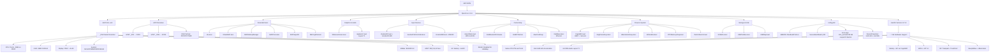

# 🗺️ EFI / ACPI / Kexts / Boot Flow – X1 Yoga Gen 5 Hackintosh

This diagram illustrates the hierarchy and relationships of your EFI folder, ACPI patches, Kexts, and boot process.

---

```mermaid
flowchart TB
    A[UEFI BIOS] --> B[OpenCore 1.0.6]
    
    B --> C[SSDT-ALL.aml]
    C --> C1[_OSI Darwin Detection]
    C1 --> C2[CPU: PLUG _DSM on PR00]
    C1 --> C3[USB: USBX 5100mA]
    C1 --> C4[Display: PNLF + ALS0]
    C1 --> C5[System: MCHC/PGMM/PMCR/SRAM]
    C1 --> C6[SMBus: BUS0/DVL0]
    C1 --> C7[HPET: IRQ 0,8,11 fixes]
    C1 --> C8[EC: Battery + HKEY]
    C1 --> C9[RHUB: Disabled for USBMap]
    
    B --> D[ACPI Renames]
    D --> D1[HPET _STA → XSTA]
    D --> D2[HPET _CRS → XCRS]
    D --> D3[IRQ Patches: IPIC/RTC/TIMR]

    B --> E[Essential Kexts]
    E --> E1[Lilu.kext]
    E --> E2[VirtualSMC.kext]
    E --> E3[SMCBatteryManager]
    E --> E4[SMCProcessor]
    E --> E5[SMCSuperIO]
    E --> E6[SMCLightSensor]
    
    B --> F[Graphics & Audio]
    F --> F1[WhateverGreen.kext]
    F --> F2[AppleALC.kext<br/>Layout 71]
    
    B --> G[Input Devices]
    G --> G1[VoodooI2C.kext + VoodooI2CHID]
    G --> G2[VoodooPS2Controller.kext]
    G --> G3[VoodooRMI.kext + RMII2C]
    
    B --> H[Connectivity]
    H --> H1[AirportItlwm.kext<br/>WiFi 6 AX201]
    H --> H2[IntelBluetoothFirmware]
    H --> H3[IntelBTPatcher]
    H --> H4[BlueToolFixup]
    H --> H5[IntelMausi.kext<br/>Ethernet]
    
    B --> I[Power & System]
    I --> I1[YogaSMC.kext<br/>HKEY + Sensors]
    I --> I2[BrightnessKeys.kext]
    I --> I3[HibernationFixup.kext]
    I --> I4[ECEnabler.kext]
    I --> I5[RTCMemoryFixup.kext]
    I --> I6[RestrictEvents.kext]
    
    B --> J[Storage & USB]
    J --> J1[NVMeFix.kext]
    J --> J2[USBToolBox.kext]
    J --> J3[USBMap.kext]

    B --> K[config.plist]
    K --> K1[SMBIOS: MacBookPro16,3]
    K --> K2[SecureBootModel: j223]
    K --> K3[boot-args: rtcfx_exclude=80-AB<br/>revpatch=sbvmm]
    K --> K4[DeviceProperties:<br/>UHD 620 + ALC285]

    B --> L[macOS Ventura 13.7.8]
    L --> M[✅ Full Hardware Support]
    M --> M1[Native CPU PM via PLUG]
    M --> M2[Intel UHD 620 Acceleration]
    M --> M3[ALC285 Audio Layout 71]
    M --> M4[Battery + EC via YogaSMC]
    M --> M5[WiFi 6 + BT 5.1]
    M --> M6[I2C Trackpad + TrackPoint]
    M --> M7[Sleep/Wake + Hibernation]
```